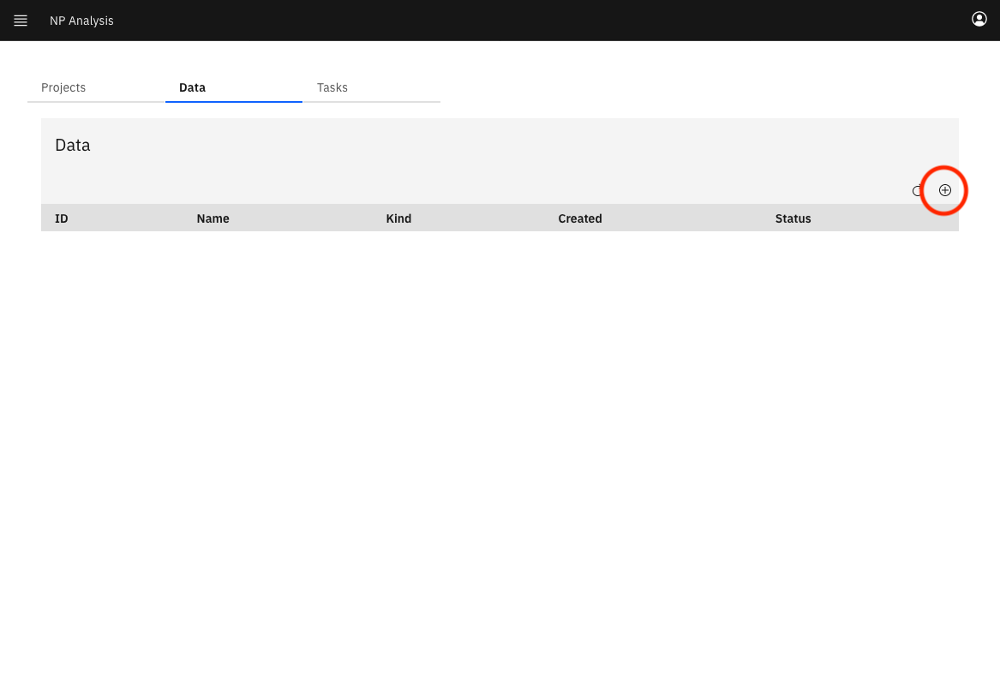
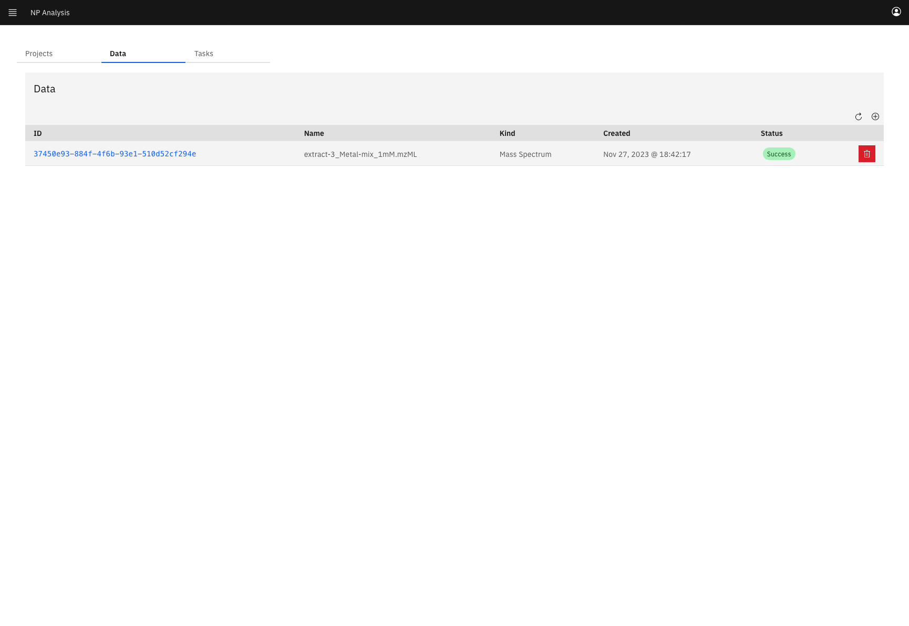
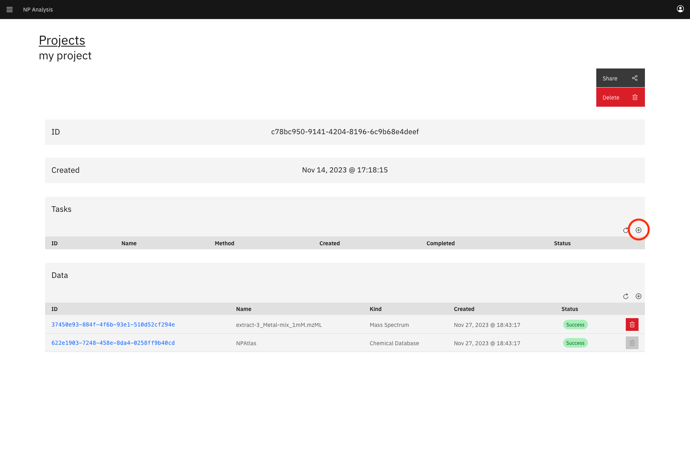
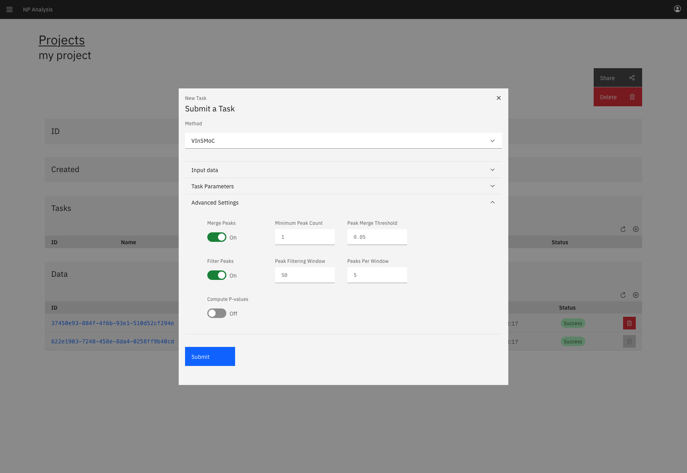
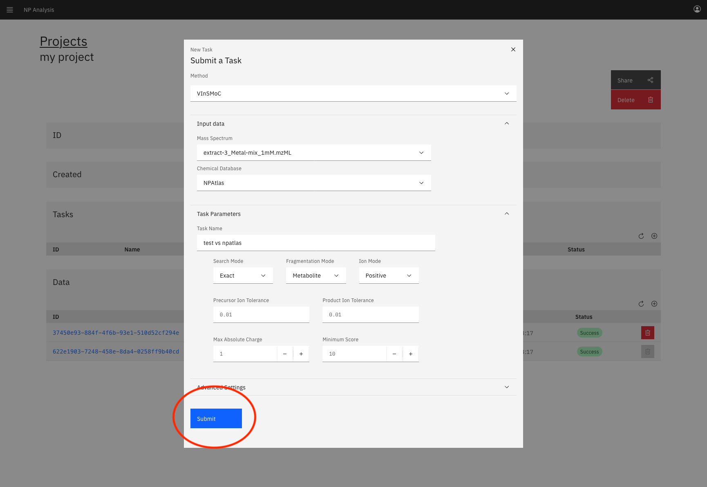
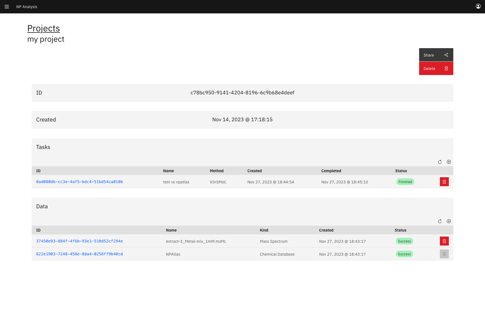

# VInSMoC

This repository documents the VInSMoC web application and runs through an example of how to launch a run.

VInSMoC is a mass spectral search tool that scores query mass spectra against a database of candidate molecules.
VInSMoC can run in exact mode or variable mode.
In exact mode VInSMoC matches query spectra to candidate molecules whose masses match the query spectra's precursor m/z.
In variable mode VInSMoC matches query spectra to candidate molecules whose variants can explain the difference Δ between the precursor mass of spectra and mass of the molecule.
VInSMoC supports both positive and negative mode spectra.

## The npanalysis.org server
VInSMoC, among other tools, is hosted at <https://run.npanalysis.org>. 

### Creating an account
If you do not have one yet, create an account at <https://run.npanalysis.org/#/signup> using your email.

### Your dashboard
You can see all relevant information at <https://run.npanalysis.org/#/dashboard>.

There are three tabs:
- Projects exist to organize your data and runs
- Data stores all data you have uploaded to our server
- Tasks stores all runs of our tools you have performed

### Creating projects
From the project tab create a new project using the plus button.

Add a name to your project and click the submit button to create a new project

### Uploading data
From the data tab click the plus button to upload your input data.

You will see a popup form.

For VInSMoC we need mass spectral inputs, so select "Mass Spectrum" as your data kind.

We support MGF, mzXML, and mzML inputs, select any such file on your computer and press submit to upload it to our sever.
In this example we use a mass spectrum file from the MSV000086287 dataset.

Each data input is parsed into a representation that is convenient for our tools to use downstream, so the data point is not immediately ready for use.

After a few minutes you should see that the data point has been successfully parsed.

Alternatively, if your input data was malformed you may see the status of the data point is an error.
If this happens double check that your input format indeed matches the declared extension.

We now have data that we can use as input to VInSMoC.

### Adding data to your project
Returning to the projects tab we can click on the ID of the project we previous created to get the project page.

Each project has two constituent tables: tasks and data.
Data is associated to a project by the user that uploaded the data point.
All public data provided by the developers is automatically available to every project.
We can see that we have access to the NPAtlas chemical database already.
However, we do not have access to our spectrum file, so we will associate it to the project using the plus button in the data table.

This will create a form where we can select our spectrum from the dropdown and click import.

We now see that our `extract-3_Metal-mix_1mM.mzML` file is available to this project.

### Running VInSMoC
We can run VInSMoC (and any future supported methods) by creating a new task with the plus button in the tasks table.

We will be greeted by a form that prompts us to select a method.

Select VInSMoC from the dropdown.

This form is split into three sections that we will fill in order.

First, we need to select the mass spectrum file and chemical database we want to use for this run.
We can do so using the dropdowns under the "Input Data" section

Next in the "Task Parameters" section we need to name our task.

The other fields under "Task Parameters" control how VInSMoC is run.
Search mode can be either exact or variable.
Fragmentation mode can work with generic molecules (Metaoblite mode) or specifically generalized peptides (Peptide mode).
The ion mode should be set to match your input spectrum (positive in our case).
Precursor and product ion tolerances determine thresholds used to match spectra to candidate molecules and theoretical fragments to experimental peaks respectively.
If you're unsure these can be safely left to the default.
The maximum absolute charge controls what adducts are used to convert m/z values to masses.
A maximum absolute charge of 1 means only `[M+H]+` or `[M-H]-` adducts are used, based on ion mode.
A maximum absolute charge of 2 means adds `[M+2H]++` or `[M-2H]--` adducts are used, based on ion mode.
Finally, the minimum score controls which hits are reported.

The advanced settings should be need to be changed often.
For VInSMoC these settings control how the mass spectral input is pre-processed before it is scored against the candidate molecules.
Peak merging combines peaks that are within "Peak Merge Threshold" of one another, making sure to leave at least "Minimum Peak Count" peaks.
Peak filtering only keeps the "Peaks Per Window" most intense peaks in m/z windows of "Peak Filtering Window".
These should be left unchanged unless you have already down some preprocessing on your input spectra before uploading to our server.

We are now ready to launch our task by clicking submit.

### Monitoring runs
Upon submission our task went into the pending state while its execution is scheduled by our backend.

Our example is small, so it finished almost immediately, but depending on your input size you may spend some time in the "Running" state.

We can click on the ID of the task to see the results.

This brings us to the task page which shows the best hit we got to each input scan that exceeded the minimum score reporting threshold.
Each molecule is a link to its entry in the original chemical database that it came from.

If the task is not finished this page will automatically refresh with an exponential backoff until the task is completed.
